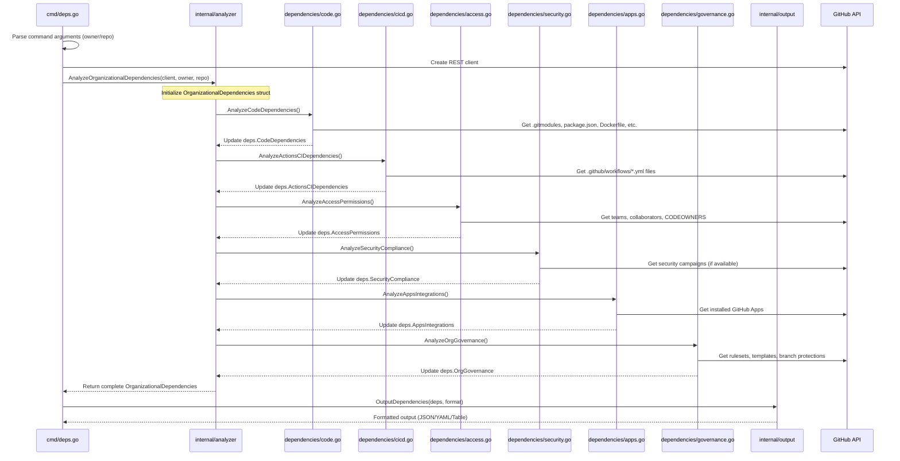
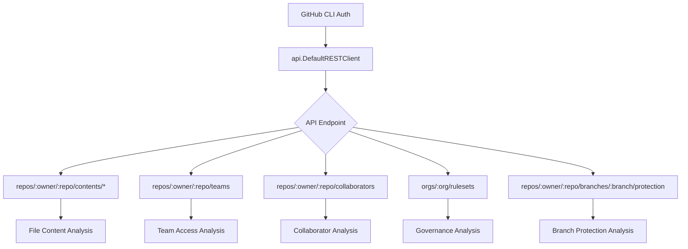

# Technical Architecture Documentation

## Overview

`gh-repo-transfer` is a GitHub CLI extension built in Go that analyzes organizational dependencies in GitHub repositories. The tool follows a modular architecture with clear separation of concerns, implementing the 6-category dependency analysis framework.

## Architecture Principles

- **Modular Design**: Each dependency category is independently analyzable
- **Clean Architecture**: Separation between CLI, business logic, and data layers
- **Single Responsibility**: Each package has a focused purpose
- **Dependency Injection**: GitHub API client is injected into analyzers
- **Extensibility**: Easy to add new dependency types or output formats

## Package Structure

```
internal/
├── analyzer/          # Orchestration layer
│   └── analyzer.go   # Main coordinator
├── dependencies/      # Business logic layer
│   ├── code.go       # Category 1: Organization-Specific Code Dependencies
│   ├── cicd.go       # Category 2: GitHub Actions & CI/CD Dependencies
│   ├── access.go     # Category 3: Access Control & Permissions
│   ├── security.go   # Category 4: Security & Compliance Dependencies
│   ├── apps.go       # Category 5: GitHub Apps & Integrations
│   └── governance.go # Category 6: Organizational Governance
├── output/            # Presentation layer
│   └── formatter.go  # JSON/YAML/Table formatters
└── types/             # Data layer
    └── types.go      # Type definitions and data structures
```

## Data Flow Architecture



## Core Components

### 1. Analyzer Layer (`internal/analyzer/`)

**Purpose**: Orchestrates the analysis process across all 6 dependency categories.

**Key Function**: `AnalyzeOrganizationalDependencies()`
- Creates empty dependency structure
- Calls each category analyzer sequentially
- Handles errors gracefully (non-fatal analysis failures)
- Returns consolidated results

### 2. Dependencies Layer (`internal/dependencies/`)

Each analyzer implements category-specific logic:

#### Code Dependencies (`code.go`)
- **Git Submodules**: Parses `.gitmodules` for same-org repositories
- **Package Registries**: Scans `package.json`, `pom.xml`, `.npmrc` for org-specific registries
- **Container Registries**: Analyzes `Dockerfile`, `docker-compose.yml` for org container registries
- **Hardcoded References**: Detects organization-specific URLs and endpoints

#### CI/CD Dependencies (`cicd.go`)
- **Workflow Analysis**: Parses `.github/workflows/*.yml` files
- **Secret Detection**: Finds `secrets.PATTERN` usage
- **Variable Detection**: Finds `vars.PATTERN` usage
- **Runner Analysis**: Identifies self-hosted and custom runners
- **Action References**: Detects organization-specific actions
- **Cross-repo Triggers**: Finds `workflow_run` and `repository_dispatch` events

#### Access Permissions (`access.go`)
- **Team Access**: Retrieves teams with repository permissions
- **Collaborators**: Gets individual user access levels
- **CODEOWNERS**: Parses code review requirements
- **Organization Roles**: Checks for custom org roles (Enterprise)

#### Security Compliance (`security.go`)
- **Security Campaigns**: Analyzes org-level security initiatives (Enterprise)
- **Compliance Frameworks**: Future extensibility for compliance checks

#### Apps & Integrations (`apps.go`)
- **GitHub Apps**: Lists organization-installed apps
- **Integration Points**: Identifies third-party integrations

#### Governance (`governance.go`)
- **Repository Rulesets**: Analyzes org-level rules
- **Templates**: Checks for issue/PR templates
- **Branch Protection**: Converts to governance requirements

### 3. Types Layer (`internal/types/`)

**Data Structures**: Defines the complete dependency model with 6 main categories:

```go
type OrganizationalDependencies struct {
    CodeDependencies      CodeDependencies      `json:"organization_specific_code_dependencies"`
    ActionsCIDependencies ActionsCIDependencies `json:"github_actions_cicd_dependencies"`
    AccessPermissions     AccessPermissions     `json:"access_control_permissions"`
    SecurityCompliance    SecurityCompliance    `json:"security_compliance_dependencies"`
    AppsIntegrations      AppsIntegrations      `json:"github_apps_integrations_dependencies"`
    OrgGovernance        OrgGovernance         `json:"organizational_governance_dependencies"`
}
```

### 4. Output Layer (`internal/output/`)

**Formatters**: Supports multiple output formats:
- **JSON**: Machine-readable structured data
- **YAML**: Human-readable structured data  
- **Table**: Terminal-friendly formatted output with emojis and counts

## API Integration Patterns

### GitHub REST API Usage



### Error Handling Strategy

- **Non-Fatal Errors**: Analysis continues if individual category fails
- **Graceful Degradation**: Missing permissions result in empty results, not failures
- **Verbose Logging**: Optional detailed error reporting
- **Fallback Behavior**: Basic analysis when detailed info unavailable

## Extension Points

### Adding New Dependency Types

1. **Create new analyzer** in `internal/dependencies/`
2. **Add fields** to relevant struct in `internal/types/`
3. **Register analyzer** in `internal/analyzer/analyzer.go`
4. **Update output** formatting in `internal/output/formatter.go`

### Adding New Output Formats

1. **Implement formatter** in `internal/output/formatter.go`
2. **Add format option** to CLI in `cmd/deps.go`
3. **Update help text** and documentation

## Performance Considerations

- **Parallel API Calls**: Could be implemented for independent analyses
- **Caching**: GitHub API responses could be cached during analysis
- **Rate Limiting**: Respects GitHub API rate limits through go-gh client
- **Memory Efficiency**: Streaming analysis of large files when possible

## Testing Strategy

- **Unit Tests**: Each analyzer can be tested independently
- **Integration Tests**: Full workflow testing with mock GitHub API
- **Test Data**: Sample repositories with known dependency patterns
- **Regression Tests**: Ensure refactoring doesn't break existing functionality

## Dependencies

- **GitHub CLI (`go-gh/v2`)**: Authentication and API client
- **Cobra**: CLI framework and command parsing
- **YAML (`gopkg.in/yaml.v3`)**: YAML output formatting
- **Standard Library**: JSON encoding, regex, string processing

## Future Architecture Considerations

- **Plugin System**: Allow external dependency analyzers
- **Configuration**: YAML/JSON config files for custom analysis rules
- **Caching Layer**: Redis/file-based caching for large organizations
- **Batch Processing**: Analyze multiple repositories in one command
- **Webhook Integration**: Real-time dependency monitoring