# Command: `archive`

## Overview

The `archive` command permanently moves a repository to an archive organization with:

1. **Automatic renaming** — a unique identifier suffix (UID) is appended to the repository name (e.g., `my-repo` → `my-repo-3KF2X9AB`) to prevent name collisions and signal the archived state.
2. **GitHub read-only archiving** — the repository is set as archived (read-only) in the target organization.
3. **Origin tracking** — the original `owner/repo` path is stored as a custom repository property (`repo-origin`) for auditability and potential future restoration.
4. **Team preservation** — optionally, all team associations and their permissions are preserved in the target organization (same three-step approach as `transfer`).

---

## Usage

```sh
gh repo-transfer archive [owner/repo...] --target-org [archive-org] [flags]
```

### Flags

| Flag | Short | Default | Description |
|------|-------|---------|-------------|
| `--target-org` | `-t` | *(required)* | Target (archive) organization |
| `--assign` | `-a` | `false` | Collect source repo teams and re-apply them with original permissions |
| `--create` | `-c` | `false` | **Step 0**: Create teams in the target org that don't already exist |
| `--enforce` | `-e` | `false` | Skip dependency validation — archive even if blockers exist |
| `--dry-run` | `-d` | `false` | Preview what would happen without executing |
| `--format` | `-f` | `table` | Output format: `table`, `json`, `yaml` |
| `--verbose` | `-v` | `false` | Enable verbose/debug output |

### Examples

```sh
# Archive a single repository
gh repo-transfer archive owner/repo --target-org archive-org

# Archive with team preservation
gh repo-transfer archive owner/repo --target-org archive-org --assign --create

# Archive skipping validation
gh repo-transfer archive owner/repo --target-org archive-org --enforce

# Preview (dry run)
gh repo-transfer archive owner/repo --target-org archive-org --dry-run

# Batch archive
gh repo-transfer archive owner/repo1 owner/repo2 --target-org archive-org
```

---

## What Makes Archive Different from Transfer

| Aspect | `transfer` | `archive` |
|--------|-----------|-----------|
| Repository name | Unchanged | Renamed with unique UID suffix |
| Read-only flag | Not set | ✅ Set (GitHub archived = read-only) |
| Origin tracking | Not stored | ✅ Stored as `repo-origin` custom property |
| Restoration path | Manual | Tracked via `repo-origin` property |
| Use case | Active migration | Decommission / long-term storage |

---

## Unique Identifier (UID) Generation

The UID appended to the archived repository name is generated by combining:

- A **timestamp component** (current time in milliseconds, base-36 encoded) — guarantees uniqueness across time.
- Two **random characters** — adds entropy for parallel/simultaneous operations.

The result is truncated to 8 characters: e.g., `3KF2X9AB`.

This means `my-repo` becomes `my-repo-3KF2X9AB` — deterministically unique and collision-resistant even at scale.

---

## Origin Tracking (`repo-origin`)

After archiving, the command stores the original `owner/repo` path as a custom property named `repo-origin` on the archived repository in the target org.

**Behavior:**
- If the target organization has a `repo-origin` custom property defined in its schema → the value is set automatically.
- If the property is **not defined** in the organization's schema → a warning is printed and the operation continues without storing the origin. No fallback to topics or description is used.

```
⚠️  Warning: Organization 'archive-org' does not have a 'repo-origin' custom property defined.
   Skipping origin tracking. To enable it, add a 'repo-origin' string property to the organization's custom property schema.
```

To enable origin tracking, add a `repo-origin` string property to the target organization's [custom property schema](https://docs.github.com/en/organizations/managing-organization-settings/managing-custom-properties-for-repositories-in-your-organization).

---

## Three-Step Process (with `--assign` and `--create`)

### Step 0 — Create Teams (`--create` / `-c`)

Before archiving, each source repository's teams are inspected. Any team that exists in the source org but is **missing from the target archive org** is created there. Teams that already exist are silently skipped.

### Step 1 — Transfer with Rename and Team IDs

The repository is transferred using the GitHub [Transfer a Repository](https://docs.github.com/en/rest/repos/repos#transfer-a-repository) API. The payload includes:
- `new_owner` — the target archive organization
- `new_name` — the renamed repository (with UID suffix)
- `team_ids` — IDs of teams in the target org (if `--assign` is set)

```json
POST /repos/{owner}/{repo}/transfer
{
  "new_owner": "archive-org",
  "new_name": "my-repo-3KF2X9AB",
  "team_ids": [16339286, 15889939]
}
```

### Step 2 — Post-Transfer Actions

After a brief stabilization delay (3 seconds), the command:

1. **Sets GitHub archive status** — `PATCH /repos/{target-org}/{new-name}` with `{"archived": true}`, making the repo read-only.
2. **Stores origin metadata** — writes the original `owner/repo` path to the `repo-origin` custom property (with fallbacks).
3. **Restores team permissions** — calls `PUT /orgs/{target-org}/teams/{slug}/repos/{target-org}/{new-name}` for each team with the original permission level.

---

## Process Flow Sequence Diagram

```mermaid
sequenceDiagram
    actor User
    participant CLI as gh repo-transfer archive
    participant GH as GitHub API
    participant GHCLI as gh CLI (team assignment)

    User->>CLI: archive owner/repo -t archive-org [-a] [-c] [-e] [-v]

    CLI->>CLI: Validate repo format (owner/repo)
    CLI->>CLI: Generate UID (timestamp + random → 8 chars)
    note over CLI: archived name = {repo}-{UID}

    CLI->>GH: GET /orgs/{archive-org}
    GH-->>CLI: ✅ Target org exists

    alt --create (-c) flag set  [STEP 0]
        CLI->>GH: GET /repos/{owner}/{repo}/teams
        GH-->>CLI: Source team list with permissions

        loop For each source team
            CLI->>GH: GET /orgs/{archive-org}/teams/{team-slug}
            alt Team does NOT exist
                CLI->>GHCLI: POST /orgs/{archive-org}/teams (via gh api)
                GHCLI-->>CLI: ✅ Team created
            else Team already exists
                CLI-->>CLI: ⏭ Skip (already exists)
            end
        end
        CLI-->>CLI: 🔨 Step 0 complete
    end

    alt --assign (-a) flag set
        CLI->>GH: GET /repos/{owner}/{repo}/teams
        GH-->>CLI: Team names + permissions collected
    end

    alt --enforce (-e) NOT set  [Validation]
        CLI->>GH: GET /repos/{owner}/{repo} (metadata, workflows, hooks, apps, rulesets...)
        GH-->>CLI: Dependency data

        CLI->>GH: GET /orgs/{archive-org} (capabilities scan)
        GH-->>CLI: Target org capabilities

        CLI->>CLI: ValidateAgainstTarget()
        alt Blockers found
            CLI-->>User: ❌ Archive blocked — N blockers found
        else No blockers
            CLI-->>CLI: ✅ Validation passed
        end
    else --enforce set
        CLI-->>CLI: ⚠️ Skipping validation (enforce mode)
    end

    alt --dry-run (-d) set
        CLI-->>User: 🗃️ DRY RUN summary\n(would archive as: {repo}-{UID})
    else Execute archive  [STEP 1]
        alt --assign (-a) set
            CLI->>GH: GET /orgs/{archive-org}/teams/{slug} (resolve team IDs)
            GH-->>CLI: Team IDs in target org
        end

        CLI->>GH: POST /repos/{owner}/{repo}/transfer\n{"new_owner":"archive-org","new_name":"{repo}-{UID}","team_ids":[...]}
        GH-->>CLI: ✅ Transfer accepted

        note over CLI: Wait 3s for GitHub to finalize transfer

        CLI->>GH: PATCH /repos/{archive-org}/{repo}-{UID}\n{"archived": true}
        GH-->>CLI: ✅ Repository marked as read-only

        CLI->>GH: PATCH /repos/{archive-org}/{repo}-{UID}/properties/values\n{"properties":[{"property_name":"repo-origin","value":"owner/repo"}]}
        alt Custom property succeeds
            GH-->>CLI: ✅ Origin stored as custom property
        else Custom property fails — fallback to topic
            CLI->>GH: PUT /repos/{archive-org}/{repo}-{UID}/topics
            GH-->>CLI: ✅ Origin stored as topic
        else Topic fails — fallback to description
            CLI->>GH: PATCH /repos/{archive-org}/{repo}-{UID}\n{"description":"[origin: owner/repo] ..."}
            GH-->>CLI: ✅ Origin stored in description
        end

        alt --assign (-a) flag set  [STEP 2 — team permissions]
            loop For each team (with original permission)
                CLI->>GHCLI: PUT /orgs/{archive-org}/teams/{slug}/repos/{archive-org}/{repo}-{UID}\n{"permission":"<original>"}
                GHCLI-->>CLI: ✅ Permission applied
            end
            CLI-->>CLI: ✅ Team assignment complete
        end

        CLI-->>User: ✅ Archived as: archive-org/{repo}-{UID} (read-only)
    end
```



---

## Batch Mode

When multiple repositories are specified:

1. Repositories are grouped by source organization.
2. The **target org capabilities are scanned once** (not per-repo).
3. Each repository gets a **unique UID** at processing time.
4. Results are reported per-repository; a single failure does not abort remaining repos.
5. Returns a non-zero exit code if any archive operation fails.

---

## Notes

- Admin permission on the source repository is required.
- The `repo-origin` property must be defined in the target organization's custom property schema for the preferred storage method to work; the command gracefully falls back to topics or description if not.
- Archived repositories are **read-only** — no commits, pull requests, or issues can be created after archiving.
- To locate the original source of an archived repo, check the `repo-origin` custom property, the repository topics, or the repository description.
