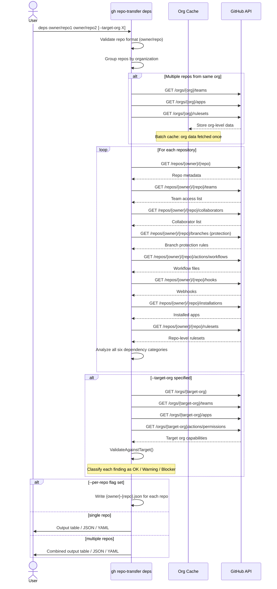

# Command: `deps`

## Overview

The `deps` command analyzes all **organizational dependencies** of one or more repositories — everything that would need to be assessed or addressed when moving a repository to a different GitHub organization. It is the primary discovery and pre-flight tool before using `transfer` or `archive`.

Results can be output as a human-readable table, JSON, or YAML, and optionally written to separate per-repository files for batch runs.

---

## Usage

```sh
gh repo-transfer deps [owner/repo...] [flags]
```

### Flags

| Flag | Short | Default | Description |
|------|-------|---------|-------------|
| `--target-org` | `-t` | — | Target organization to validate dependencies against |
| `--format` | `-f` | `table` | Output format: `table`, `json`, `yaml` |
| `--per-repo` | `-p` | `false` | Write results to individual JSON files per repository |
| `--verbose` | `-v` | `false` | Enable verbose/debug output |

### Examples

```sh
# Analyze a single repository
gh repo-transfer deps owner/repo

# Analyze multiple repositories (batch mode with caching)
gh repo-transfer deps owner/repo1 owner/repo2 owner/repo3

# Analyze and validate against a target organization
gh repo-transfer deps owner/repo --target-org target-org

# Output as JSON
gh repo-transfer deps owner/repo --format json

# Write each repo's results to its own file
gh repo-transfer deps owner/repo1 owner/repo2 --per-repo
```

---

## What It Analyzes

The command examines **six dependency categories**:

| Category | Description |
|----------|-------------|
| **Code Dependencies** | References to org-internal packages, private registries, org-specific URLs |
| **CI/CD Dependencies** | GitHub Actions workflows referencing internal actions, runners, secrets, or environments |
| **Access & Permissions** | Teams, individual collaborators, deploy keys, outside collaborators |
| **Security & Compliance** | Branch protection rules, required status checks, secret scanning, GHAS settings |
| **Apps & Integrations** | Installed GitHub Apps, webhooks, OAuth integrations |
| **Governance** | Rulesets, CODEOWNERS, required reviewers, merge strategies |

When `--target-org` is provided, each category is also **validated** against the target organization's capabilities and returns one of:

- ✅ `OK` — No action required
- ⚠️ `Warning` — Should be reviewed, not a hard blocker
- ❌ `Blocker` — Must be resolved before transfer

### Batch Optimization

When multiple repositories from the **same organization** are specified, org-level data (teams, apps, rulesets, etc.) is fetched **once and cached**, significantly reducing GitHub API calls.

---

## Process Flow Sequence Diagram



---

## Output Structure

When using `--format json`, the output follows this structure:

```json
{
  "repository": "owner/repo",
  "code_dependencies": [...],
  "ci_cd_dependencies": [...],
  "access_permissions": [...],
  "security_compliance": [...],
  "apps_integrations": [...],
  "governance": [...],
  "validation": {
    "summary": {
      "total": 12,
      "ok": 8,
      "warnings": 3,
      "blockers": 1
    },
    ...
  }
}
```

---

## Notes

- The `deps` command is **read-only** — it never modifies any repository or organization.
- It is the recommended first step before running `transfer` or `archive`.
- Blockers identified by `deps --target-org` are the same checks enforced by `transfer` (unless `--enforce` is used).
