# Command: `transfer`

## Overview

The `transfer` command moves one or more repositories from a source organization to a target organization. It preserves team associations and their exact permissions through a structured three-step process, with optional pre-flight validation to catch blockers before execution.

---

## Usage

```sh
gh repo-transfer transfer [owner/repo...] --target-org [target-org] [flags]
```

### Flags

| Flag | Short | Default | Description |
|------|-------|---------|-------------|
| `--target-org` | `-t` | *(required)* | Target organization to transfer the repository into |
| `--assign` | `-a` | `false` | Collect source repo teams and re-apply them with original permissions after transfer |
| `--create` | `-c` | `false` | **Step 0**: Create teams in the target org that don't already exist |
| `--enforce` | `-e` | `false` | Skip dependency validation — transfer even if blockers exist |
| `--dry-run` | `-d` | `false` | Preview what would happen without executing |
| `--format` | `-f` | `table` | Output format: `table`, `json`, `yaml` |
| `--verbose` | `-v` | `false` | Enable verbose/debug output |

### Examples

```sh
# Basic transfer
gh repo-transfer transfer owner/repo --target-org target-org

# Transfer with full team preservation (recommended)
gh repo-transfer transfer owner/repo --target-org target-org --assign --create

# Transfer skipping validation, with team creation and assignment
gh repo-transfer transfer owner/repo --target-org target-org --enforce --assign --create

# Preview without executing
gh repo-transfer transfer owner/repo --target-org target-org --dry-run

# Batch transfer (multiple repos)
gh repo-transfer transfer owner/repo1 owner/repo2 --target-org target-org --assign
```

---

## Three-Step Process

### Step 0 — Create Teams (`--create` / `-c`)

Before any transfer occurs, the command inspects which teams are associated with the source repository and creates any that are **missing** in the target organization. Teams that already exist are silently skipped. This ensures the transfer payload (Step 1) can include valid `team_ids`.

### Step 1 — Transfer with Team Assignment

The repository is transferred to the target organization using the GitHub [Transfer a Repository](https://docs.github.com/en/rest/repos/repos#transfer-a-repository) API. If teams were collected (via `--assign`), their **IDs in the target org** are resolved and included in the `team_ids` field of the transfer payload.

```json
POST /repos/{owner}/{repo}/transfer
{
  "new_owner": "target-org",
  "team_ids": [16339286, 15889939]
}
```

### Step 2 — Restore Team Permissions

After the transfer completes, the command waits for GitHub to finalize the operation, then calls `PUT /orgs/{org}/teams/{team-slug}/repos/{org}/{repo}` for each team — setting the **exact same permission** (`triage`, `maintain`, `push`, `pull`, `admin`, or a custom role) that the team had on the source repository.

---

## Origin Tracking (`repo-origin`)

After every successful transfer, the command stores the original `owner/repo` path as a custom property named `repo-origin` on the transferred repository in the target org.

**Behavior:**
- If the target organization has a `repo-origin` custom property defined in its schema → the value is set automatically.
- If the property is **not defined** in the organization's schema → a warning is printed and the operation continues without storing the origin. No fallback to topics or description is used.

```
⚠️  Warning: Organization 'target-org' does not have a 'repo-origin' custom property defined.
   Skipping origin tracking. To enable it, add a 'repo-origin' string property to the organization's custom property schema.
```

To enable origin tracking, add a `repo-origin` string property to the target organization's [custom property schema](https://docs.github.com/en/organizations/managing-organization-settings/managing-custom-properties-for-repositories-in-your-organization).

---

## Validation

Unless `--enforce` is used, the command first runs the same dependency analysis as `deps`, checking:

- Code dependencies on org-internal packages
- CI/CD workflows referencing org-specific resources
- Access control (teams, collaborators, deploy keys)
- Security & compliance settings
- Installed apps and integrations
- Governance rules (rulesets, CODEOWNERS)

If **any blocker** is found, the transfer is halted for that repository. Use `--enforce` (`-e`) to bypass this check.

### Missing Teams as Blockers

Teams that exist on the source repository but are **absent from the target org** are treated as **blockers** unless `--create` (`-c`) is used to create them first.

---

## Process Flow Sequence Diagram

```mermaid
sequenceDiagram
    actor User
    participant CLI as gh repo-transfer transfer
    participant GH as GitHub API
    participant GHCLI as gh CLI (team assignment)

    User->>CLI: transfer owner/repo -t target-org [-a] [-c] [-e] [-v]

    CLI->>CLI: Validate repo format (owner/repo)
    CLI->>GH: GET /orgs/{target-org}
    GH-->>CLI: ✅ Target org exists

    alt --create (-c) flag set  [STEP 0]
        CLI->>GH: GET /repos/{owner}/{repo}/teams
        GH-->>CLI: Source team list with permissions

        loop For each source team
            CLI->>GH: GET /orgs/{target-org}/teams/{team-slug}
            alt Team does NOT exist
                CLI->>GHCLI: POST /orgs/{target-org}/teams (via gh api)
                GHCLI-->>CLI: ✅ Team created
            else Team already exists
                CLI-->>CLI: ⏭ Skip (already exists)
            end
        end
        CLI-->>CLI: 🔨 Step 0 complete
    end

    alt --assign (-a) flag set
        CLI->>GH: GET /repos/{owner}/{repo}/teams
        GH-->>CLI: Team names collected for transfer
    end

    alt --enforce (-e) NOT set  [Validation]
        CLI->>GH: GET /repos/{owner}/{repo} (metadata, workflows, hooks, apps, rulesets...)
        GH-->>CLI: Dependency data

        CLI->>GH: GET /orgs/{target-org} (capabilities scan)
        GH-->>CLI: Target org capabilities

        CLI->>CLI: ValidateAgainstTarget()
        alt Blockers found
            CLI-->>User: ❌ Transfer blocked — N blockers found
        else No blockers
            CLI-->>CLI: ✅ Validation passed
        end
    else --enforce set
        CLI-->>CLI: ⚠️ Skipping validation (enforce mode)
    end

    alt --dry-run (-d) set
        CLI-->>User: 🔍 DRY RUN summary (no changes made)
    else Execute transfer  [STEP 1]
        CLI->>GH: GET /orgs/{target-org}/teams/{slug} (resolve team IDs)
        GH-->>CLI: Team IDs in target org

        CLI->>GH: POST /repos/{owner}/{repo}/transfer\n{"new_owner":"target-org","team_ids":[...]}
        GH-->>CLI: ✅ Transfer accepted / new location

        alt --assign (-a) flag set  [STEP 2]
            note over CLI: Wait 10s for GitHub to finalize transfer

            loop For each team (with original permission)
                CLI->>GHCLI: PUT /orgs/{target-org}/teams/{slug}/repos/{target-org}/{repo}\n{"permission":"<original>"}
                GHCLI-->>CLI: ✅ Permission applied
            end
            CLI-->>CLI: ✅ Team assignment complete
        end

        CLI-->>User: ✅ Successfully transferred N repositories
    end
```



---

## Batch Mode

When multiple repositories are specified, the command:

1. Groups repositories by source organization.
2. Pre-scans the **target org capabilities once** (not per-repo) for efficient validation.
3. Processes all repositories sequentially, reporting per-repo success/failure.
4. Returns a non-zero exit code if **any** transfer fails.

---

## Notes

- Admin permission on the source repository is required for transfer.
- The GitHub transfer API requires `team_ids` to reference teams that already exist in the **target** organization — which is exactly why `--create` (`-c`) exists.
- Step 2 uses the `gh` CLI directly for team permission assignment (more reliable than the REST client for `PUT` operations).
- A 10-second delay is applied between Step 1 and Step 2 to allow GitHub's backend to finalize the transfer before permissions are updated.
